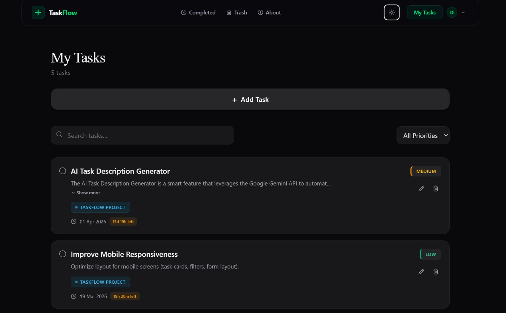

<div align="center">


# Noto — Frontend

> *A clean, fast, and feature-rich task manager built with React 19 & Vite 7*

[](https://taskflow.imandatta.com)
[](https://react.dev/)
[](https://vitejs.dev/)
[](https://redux-toolkit.js.org/)
[](https://tailwindcss.com/)

</div>

---

## 📖 Table of Contents

- [Overview](#overview)
- [Features](#features)
- [Tech Stack](#tech-stack)
- [Project Structure](#project-structure)
- [Getting Started](#getting-started)
- [Environment Variables](#environment-variables)
- [Available Scripts](#available-scripts)
- [Related](#related)

---

## Overview

This is the **frontend** of DoTo — a modern, full-stack productivity app. The UI is built with React 19 and Vite 7, styled with Tailwind CSS, and powered by Redux Toolkit for global state. It communicates with the [DoTo Backend](https://github.com/Iman-Datta/TaskFlow-backend) over a REST API.

The design prioritizes speed, accessibility, and a distraction-free user experience — using Radix UI primitives, smooth toasts via Sonner, and elegant typography with Cormorant Garamond.

---
## 📸 Preview

<div align="center">
  <table>
    <tr>
      <td align="center">
        <br/>
        <sub><b>Home Page</b></sub>
      </td>
      <td align="center">
        <br/>
        <sub><b>Task Management</b></sub>
      </td>
      <td align="center">
        <br/>
        <sub><b>Completed Tasks</b></sub>
      </td>
    </tr>
  </table>
</div>

---

## ✨ Features

### 🗂 Task Management
- **Create, edit & delete** tasks with an intuitive interface
- Set **due dates** with a polished interactive calendar
- Assign **priority levels** (e.g. Low / Medium / High)
- **Filter tasks** by status, priority, or due date
- Tasks persist across sessions via backend API

### 🗑 Recycle Bin
- Deleted tasks land in a **recycle bin** instead of vanishing immediately
- **Auto-deleted after 24 hours** by a backend cron job
- **Restore** any task from the bin before the window closes

### 🔐 Authentication (Multiple Methods)
| Method | Description |
|--------|-------------|
| 📧 Email & Password | Classic register/login flow |
| 🔵 Google OAuth | One-click sign-in via Google |
| 🔗 Magic Link | Passwordless — get a login link in your email |
| 🔢 Forgot Password OTP | OTP-based secure password reset |
| 🔄 Token Refresh | Silent access token renewal using HTTP-only refresh token cookies |

### 🎨 UI & UX Highlights
- Fully responsive layout for mobile and desktop
- Accessible components via **Radix UI** (no ARIA hacks)
- Real-time feedback with **Sonner** toast notifications
- Smooth, consistent styling with Tailwind utility classes

---

## 🛠 Tech Stack

| Package | Version | Purpose |
|---------|---------|---------|
| `react` | 19 | Core UI library |
| `vite` | 7 | Lightning-fast build tool & dev server |
| `react-router-dom` | 7 | Client-side routing |
| `@reduxjs/toolkit` | 2 | State management |
| `react-redux` | 9 | React bindings for Redux |
| `tailwindcss` | 3 | Utility-first CSS framework |
| `@radix-ui/react-checkbox` | 1.3 | Accessible checkbox primitive |
| `@radix-ui/react-popover` | 1.1 | Accessible popover / dropdown |
| `@radix-ui/react-slot` | 1.2 | Slot composition primitive |
| `lucide-react` | 0.575 | Clean icon set |
| `react-icons` | 5 | Extended icon library |
| `react-day-picker` | 9 | Calendar date picker |
| `date-fns` | 4 | Date formatting & utilities |
| `sonner` | 2 | Elegant toast notifications |
| `clsx` + `tailwind-merge` | — | Conditional class merging |
| `class-variance-authority` | 0.7 | Variant-based component styling |
| `@fontsource-variable/cormorant-garamond` | 5 | Premium serif typography |

---

## 📁 Project Structure

```
TaskFlow/
├── public/                    # Static assets
├── src/
│   ├── app/                   # Redux store configuration
│   ├── components/            # Reusable UI components
│   │   ├── ui/                # Base design system (Button, Input, etc.)
│   │   └── ...                # Feature-specific components
│   ├── features/              # Redux slices
│   │   ├── auth/              # Auth state & async thunks
│   │   └── tasks/             # Task state & async thunks
│   ├── pages/                 # Route-level page components
│   │   ├── LoginPage.jsx
│   │   ├── RegisterPage.jsx
│   │   ├── DashboardPage.jsx
│   │   └── BinPage.jsx
│   ├── lib/                   # Utilities & helpers
│   ├── App.jsx                # Root component & routes
│   └── main.jsx               # Entry point
├── index.html
├── vite.config.js
├── tailwind.config.js
├── postcss.config.js
└── package.json
```

---

## 🚀 Getting Started

### Prerequisites

- **Node.js** `v18+`
- The [TaskFlow Backend](https://github.com/Iman-Datta/TaskFlow-backend) running locally or deployed

### Installation

```bash
# 1. Clone the repo
git clone https://github.com/Iman-Datta/TaskFlow.git
cd TaskFlow

# 2. Install dependencies
npm install

# 3. Set up environment variables (see below)
cp .env.example .env

# 4. Start the dev server
npm run dev
```

The app will be available at **http://localhost:5173**

---

## 🔑 Environment Variables

Create a `.env` file in the root of the project:

```env
# URL of the TaskFlow backend API
VITE_API_URL=http://localhost:5000/api

# Google OAuth Client ID (from Google Cloud Console)
VITE_GOOGLE_CLIENT_ID=your_google_client_id_here
```

> **Note:** All frontend environment variables must be prefixed with `VITE_` to be accessible in the app.

---

## 📜 Available Scripts

| Command | Description |
|---------|-------------|
| `npm run dev` | Start the development server (HMR enabled) |
| `npm run build` | Build for production (outputs to `dist/`) |
| `npm run preview` | Preview the production build locally |
| `npm run lint` | Run ESLint |

---

## 🔗 Related

| Repo / Link | Description |
|-------------|-------------|
| [TaskFlow Backend](https://github.com/Iman-Datta/TaskFlow-backend) | Express + MongoDB REST API |
| [Live App](https://taskflow.imandatta.com) | Deployed production app |

---

<div align="center">

Made with ❤️ by [Iman Datta](https://github.com/Iman-Datta)

</div>
